# OpenClaw (Clawdbot) - AI 上下文索引

> 更新时间：2026-03-04 08:15:00
> 基于提交：952fc00598 (Merge upstream/main)

## 📊 文档覆盖率统计

| 模块分类            | 模块数 | 已文档化 | 覆盖率 |
| ------------------- | ------ | -------- | ------ |
| **核心模块 (src/)** | 55     | 55       | 100%   |
| **扩展插件**        | 44     | 44       | 100%   |
| **其他模块**        | 8      | 8        | 100%   |

**详细分布**:

- src/: 55 (含 agents:10, cli:10, commands:8, channels:3, gateway:4 等)
- extensions/: 43 (扩展插根目录 + 各扩展内部)
- apps/: 1, scripts/: 2, skills/: 1, ui/: 1, packages/: 1, Swabble/: 1, docs/: 1, 根: 1

**总计**：107 个 CLAUDE.md 文件

> 注：44/44 扩展插件已文档化 (100% 覆盖率) ✅

## 项目概览

OpenClaw（原名 clawdbot）是一个**个人 AI 助手**，在自有设备上运行。它可以在您使用的通信渠道上回答问题（WhatsApp、Telegram、Slack、Discord、Google Chat、Signal、iMessage、Microsoft Teams 等），支持语音唤醒和实时 Canvas 渲染。

## ✨ 项目结构图

```mermaid
graph TD
    A["(根) OpenClaw"] --> B["src - 核心代码"];
    A --> C["extensions - 扩展插件"];
    A --> D["ui - Web 控制界面"];
    A --> E["apps - 原生应用"];
    A --> F["skills - AI 技能"];
    A --> G["packages - 兼容包"];
    A --> H["scripts - 构建脚本"];
    A --> I["vendor - 第三方依赖"];

    B --> B1["agents - AI 代理运行时"];
    B --> B2["gateway - 网关服务器"];
    B --> B3["channels - 通信渠道"];
    B --> B4["config - 配置系统"];
    B --> B5["browser - 浏览器控制"];
    B --> B6["cli - 命令行工具"];
    B --> B7["sessions - 会话管理"];
    B --> B8["cron - 定时任务"];

    C --> C1["discord - Discord 适配器"];
    C --> C2["slack - Slack 适配器"];
    C --> C3["telegram - Telegram 适配器"];
    C --> C4["whatsapp - WhatsApp 适配器"];
    C --> C5["signal - Signal 适配器"];
    C --> C6["imessage - iMessage 适配器"];
    C --> C7["msteams - Teams 适配器"];
    C --> C8["matrix - Matrix 适配器"];
    C --> C9["feishu - 飞书适配器"];
    C --> C10["nostr - Nostr 适配器"];
    C --> C11["twitch - Twitch 适配器"];
    C --> C12["... +26 更多"];

    E --> E1["macos - macOS 应用"];
    E --> E2["ios - iOS 节点"];
    E --> E3["android - Android 节点"];

    F --> F1["bundled - 内置技能"];
    F --> F2["workspace - 工作区技能"];
    F --> F3["managed - 托管技能"];

    G --> G1["clawdbot - 兼容垫片"];
    G --> G2["moltbot - 兼容垫片"];

    click B "./src/CLAUDE.md" "查看核心代码文档"
    click C "./extensions/CLAUDE.md" "查看扩展插件文档"
    click D "./ui/CLAUDE.md" "查看 UI 文档"
    click E "./apps/CLAUDE.md" "查看原生应用文档"
    click F "./skills/CLAUDE.md" "查看技能文档"
```



## 🌟 核心特性

### 多渠道支持

- **即时通讯平台**: WhatsApp、Telegram、Slack、Discord、Google Chat、Signal、LINE
- **企业协作**: Microsoft Teams、Matrix、Nextcloud Talk、Mattermost、飞书 (Feishu)
- **扩展渠道**: BlueBubbles (iMessage)、Linq (真·iMessage API)、Zalo、Twitch、Nostr、IRC
- **语音渠道**: Voice Call、Talk Voice 🆕
- **认证扩展**: Google Antigravity Auth、Google Gemini CLI Auth、Minimax Portal Auth、Qwen Portal Auth、OpenAI Codex Auth
- **国际化**: 中文界面翻译 (openclaw-zh-cn-ui)
- **Web 界面**: WebChat 控制界面

### AI 代理能力

- **Pi Agent 运行时**: 基于 Pi AI 的 RPC 模式代理
- **多模型支持**: Anthropic Claude、OpenAI、Google Gemini、MiniMax (原生)、本地模型
- **第三方模型支持**: DeepSeek (通过 Venice、Hugging Face、Ollama、OpenRouter 等)
- **工具流**: 实时工具调用和块流处理
- **会话管理**: 主会话、组隔离、激活模式、队列模式

### 浏览器自动化

- **专用浏览器**: 基于 Playwright 的 Chrome/Chromium 控制
- **CDP 桥接**: Chrome DevTools Protocol 集成
- **快照和操作**: 页面快照、交互操作、文件上传

### 原生应用

- **macOS 应用**: 菜单栏控制平面、语音唤醒、Talk Mode
- **iOS 节点**: Canvas、语音唤醒、相机、屏幕录制
- **Android 节点**: Canvas、Talk Mode、相机、屏幕录制

### 新增功能 (v2026.3.2)

- **PDF 分析工具**: 原生 PDF 支持与 AI 分析
- **Docker 沙箱**: 可选沙箱部署支持
- **内存插件**: memory-core、memory-lancedb 持久化存储
- **语音增强**: Talk Mode 延迟追踪优化
- **安全加固**: API token 过滤、SSRF allowlist

## 🏗️ 架构总览

### 核心架构

```
通信渠道层 (WhatsApp/Telegram/Slack/Discord/etc.)
    ↓
网关控制层 (Gateway WebSocket Server)
    ↓
├── AI 代理运行时 (Pi Agent RPC)
├── 命令行工具 (CLI)
├── WebChat UI
├── macOS 应用
└── iOS/Android 节点
```

### 技术栈

**后端核心**:

- **语言**: TypeScript (ES2023+)
- **运行时**: Node.js ≥22
- **构建工具**: tsdown、rolldown
- **包管理**: pnpm

**依赖框架**:

- **AI SDK**: @mariozechner/pi-agent-core
- **浏览器**: playwright-core
- **通信**:
  - WhatsApp: @whiskeysockets/baileys
  - Telegram: grammy
  - Slack: @slack/bolt
  - Discord: discord-api-types
- **Web**: Hono、Express
- **数据库**: sqlite-vec

**前端 UI**:

- **框架**: Lit
- **构建**: Vite
- **测试**: Playwright、Vitest

**原生应用**:

- **macOS**: Swift、Speech.framework
- **iOS**: SwiftUI
- **Android**: Kotlin + Jetpack Compose

**质量工具**:

- **Lint**: oxlint
- **Format**: oxfmt
- **测试**: Vitest
- **覆盖率**: @vitest/coverage-v8

## 📚 模块索引

| 模块路径         | 主要语言          | 职责描述         | 文档状态 |
| ---------------- | ----------------- | ---------------- | -------- |
| **src**          | TypeScript        | 核心业务逻辑     | ✅ 完整  |
| **extensions**   | TypeScript        | 通信渠道扩展     | ✅ 完整  |
| **ui**           | TypeScript/Lit    | Web 控制界面     | ✅ 完整  |
| **apps/macos**   | Swift             | macOS 原生应用   | ✅ 完整  |
| **apps/ios**     | SwiftUI           | iOS 节点         | ✅ 完整  |
| **apps/android** | Kotlin            | Android 节点     | ✅ 完整  |
| **skills**       | TypeScript/Python | AI 技能集        | ✅ 完整  |
| **packages**     | TypeScript        | 兼容性垫片       | ✅ 完整  |
| **scripts**      | TypeScript/Shell  | 构建部署脚本     | ✅ 完整  |
| **Swabble**      | Swift             | 语音唤醒守护进程 | ✅ 完整  |

## 🔧 核心子系统

### 1. AI 代理运行时 (`src/agents/`)

- **Pi 嵌入式代理**: `pi-embedded-helpers/` - Pi Agent 集成
- **CLI 运行器**: `cli-runner/` - 命令行执行
- **工具系统**: `tools/` - 工具注册和策略
- **Sandbox**: `sandbox/` - Docker 沙箱隔离
- **技能系统**: `skills/` - 工作区技能管理
- **认证配置**: `auth-profiles/` - API 密钥和认证配置管理

### 2. 网关服务器 (`src/gateway/`)

- **WebSocket 服务器**: `server/` - 实时通信
- **协议**: `protocol/` - Gateway 协议定义
- **服务器方法**: `server-methods/` - RPC 方法实现
- **注册表**: 客户端管理

### 3. 通信渠道 (`src/channels/`)

- **插件系统**: `plugins/` - 渠道插件架构
- **目录**: 渠道发现和加载
- **Allowlists**: `allowlists/` - 安全允许列表
- **适配器**: 各平台适配器实现

### 4. 配置系统 (`src/config/`)

- **配置加载**: 配置文件解析
- **类型定义**: Zod schema 定义
- **迁移**: 配置版本迁移

### 5. 浏览器控制 (`src/browser/`)

- **Playwright 集成**: 浏览器自动化
- **CDP 桥接**: Chrome DevTools Protocol 集成
- **路由**: 浏览器工具路由
- **CLI Actions**: 交互式浏览器操作

### 6. 扩展插件系统 (`extensions/`)

**44 个扩展插件：**

**通信渠道 (35个)**:

- discord, slack, telegram, whatsapp, signal, imessage
- msteams, matrix, mattermost, nextcloud-talk, synology-chat
- feishu, line, zalo, zalouser, nostr, irc, twitch
- googlechat, voice-call, talk-voice 🆕

**认证扩展 (6个)**:

- google-antigravity-auth, google-gemini-cli-auth
- minimax-portal-auth, qwen-portal-auth
- openai-codex-auth, linq (iMessage API)

**功能扩展 (6个)**:

- bluebubbles (iMessage 桥接)
- device-pair (设备配对)
- copilot-proxy (Copilot 代理)
- diagnostics-otel (OpenTelemetry 诊断)
- phone-control (电话控制)
- open-prose (写作辅助)

**工具扩展 (8个)**:

- llm-task (LLM 任务管理)
- lobster (工具集)
- test-utils (测试工具)
- thread-ownership (线程管理)
- tlon (同步工具)
- diffs (差异对比) 🆕
- memory-core (内存核心) 🆕
- memory-lancedb (LanceDB 存储) 🆕

**其他 (4个)**:

- acpx (包管理)
- openclaw-zh-cn-ui (中文界面)
- shared (共享组件)

### 7. CLI 子系统 (`src/cli/`)

- **program**: CLI 程序入口
- **gateway-cli**: 网关管理
- **cron-cli**: 定时任务
- **daemon-cli**: 守护进程
- **nodes-cli**: 节点管理
- **update-cli**: 更新管理
- **node-cli**: 节点运行时
- **browser-cli-actions**: 浏览器交互
- **shared**: 共享工具

## 🚀 运行与开发

### 快速开始

```bash
# 安装
npm install -g openclaw@latest

# 初始化向导
openclaw onboard --install-daemon

# 启动网关
openclaw gateway --port 18789 --verbose

# 发送消息
openclaw message send --to +1234567890 --message "Hello"

# 与 AI 代理对话
openclaw agent --message "Ship checklist" --thinking high
```

### 从源码开发

```bash
# 克隆仓库
git clone https://github.com/openclaw/openclaw.git
cd openclaw

# 安装依赖
pnpm install

# 构建
pnpm build

# UI 构建
pnpm ui:build

# 开发循环（自动重载）
pnpm gateway:watch
```

### 主要命令

- `pnpm build` - 构建所有模块
- `pnpm test` - 运行单元测试
- `pnpm test:e2e` - 运行端到端测试
- `pnpm lint` - 代码检查
- `pnpm format:fix` - 代码格式化
- `pnpm openclaw ...` - 运行 TypeScript 直接执行
- `pnpm gateway:watch` - 网关开发模式

## 🧪 测试策略

### 测试类型

- **单元测试**: `src/**/*.test.ts` - Vitest 单元测试
- **E2E 测试**: `scripts/e2e/*.sh` - Docker 化的端到端测试
- **Live 测试**: `src/**/*.live.test.ts` - 需要真实 API 的测试
- **Browser 测试**: `ui/**/*.browser.test.ts` - Playwright 浏览器测试

### 测试覆盖率

- **覆盖率目标**: 70% (行、函数、分支、语句)
- **覆盖率提供者**: v8
- **报告格式**: text、lcov

### 运行测试

```bash
# 所有测试
pnpm test:all

# 仅单元测试
pnpm test

# E2E 测试
pnpm test:e2e

# Live 测试（需要 API 密钥）
pnpm test:live

# UI 测试
pnpm test:ui

# 覆盖率报告
pnpm test:coverage
```

## 📝 编码规范

### TypeScript 规范

- **严格模式**: 启用所有严格类型检查
- **目标**: ES2023
- **模块**: NodeNext
- **导入**: 支持扩展名导入
- **声明**: 生成 `.d.ts` 类型声明文件

### 代码风格

- **格式化**: oxfmt (统一代码格式)
- **Lint**: oxlint (类型感知 Lint)
- **最大 LOC**: 500 行（检查脚本强制执行）
- **Swift**: swiftformat + swiftlint

### Git 规范

- **Hooks**: git-hooks (通过 prepare 脚本安装)
- **提交**: 建议使用约定式提交
- **分支**: main (稳定)、功能分支开发

## 🤖 AI 使用指引

### 项目级 AI 约束

1. **不修改源代码**: 仅生成/更新文档
2. **忽略规则**: 优先使用 `.gitignore`，合并默认忽略规则
3. **大文件处理**: 仅记录路径，不读取内容

### 模块级开发建议

1. **渠道开发**: 参考 `extensions/` 中的现有适配器
2. **工具开发**: 扩展 `src/agents/tools/` 中的工具定义
3. **技能开发**: 使用 `skills/` 创建新技能
4. **UI 开发**: 基于 `ui/src/ui/` 中的控制器模式
5. **认证开发**: 扩展 `src/agents/auth-profiles/` 管理 API 密钥

### 技术栈选择参考

- **新渠道**: 优先使用 TypeScript，遵循 `extensions/*/src/runtime.ts` 模式
- **浏览器工具**: 扩展 `src/browser/routes/` 中的路由定义
- **配置**: 在 `src/config/types.*.ts` 中添加 Zod schema
- **认证配置**: 扩展 `src/agents/auth-profiles/` 添加新的认证提供商

## 🔄 变更记录

### 2026-03-04 08:15:00 - Upstream 大规模同步 🔄

- ✅ 从 upstream (openclaw/openclaw) 同步 3,386 个新提交
- ✅ 合并提交：952fc00598
- ✅ 更新至 v2026.3.2 版本
- 📈 **扩展插件**: 40 → 44 (+5 个)
- 📈 **CLAUDE.md 文件**: 76 → 107 (+31 个)
- 🆕 **新增扩展**:
  - `diffs` - 差异对比工具
  - `googlechat` - Google Chat 集成
  - `memory-core` - 内存核心模块
  - `memory-lancedb` - LanceDB 持久化存储
  - `talk-voice` - Talk Mode 语音增强
- 🆕 **新功能**:
  - PDF 分析工具 (原生 PDF 支持)
  - Docker 沙箱支持 (可选部署)
  - 安全加固 (API token 过滤、SSRF allowlist)
  - iOS Live Activity 状态显示
  - 测试代码大规模去重
- 📝 备份分支：`backup-before-upstream-sync-20260304-080010`

### 2026-03-02 11:30:00 - 上游同步检查

- ✅ 确认本地与 origin/main 完全同步
- ✅ 更新上下文文档时间戳

### 2026-02-20 10:45:00 - 扩展插件文档 100% 覆盖

- ✅ 为 `shared` 扩展创建 CLAUDE.md 文档
- ✅ 更新文档覆盖率统计至 100% (40/40 扩展插件)

### 2026-02-17 08:01:00 - 扩展插件库更新

- ✅ 发现 4 个新扩展插件：linq、openai-codex-auth、openclaw-zh-cn-ui、shared
- ✅ 更新扩展插件总数：36 → 40 个

### 2026-02-16 18:33:23 - 自适应初始化完成

- ✅ 执行 OpenClaw 项目的自适应初始化
- ✅ 验证文档覆盖率：71 个 CLAUDE.md 文件（100% 覆盖率）

### 2026-02-08 - 初始化 AI 上下文文档系统

- ✅ 创建根级 `CLAUDE.md` 文档
- ✅ 建立项目结构图（Mermaid）
- ✅ 完成核心模块索引

## 📊 扫描统计

### 文件统计

- **总文件数**: ~5500+ 文件
- **TypeScript 文件**: ~5458
- **测试文件**: ~400+
- **文档文件**: ~200+
- **配置文件**: ~100+

### 模块覆盖

- **核心模块 (src/)**: ✅ 100% 覆盖 (61 个子模块)
- **扩展模块 (extensions/)**: ✅ 100% 覆盖 (44/44 个扩展)
- **UI 模块 (ui/)**: ✅ 100% 覆盖
- **原生应用 (apps/)**: ✅ 100% 覆盖
- **技能模块 (skills/)**: ✅ 100% 覆盖
- **脚本模块 (scripts/)**: ✅ 100% 覆盖

### 被忽略目录

- `node_modules/` - npm 依赖
- `dist/` - 构建输出
- `.git/` - Git 元数据
- `apps/ios/*.xcodeproj/` - Xcode 项目
- `apps/macos/.build/` - macOS 构建缓存
- `vendor/a2ui/renderers/*/dist/` - 第三方构建

## 🎯 推荐的下一步

### 优先补扫

1. **新扩展详细文档**: 为 5 个新扩展创建详细文档
2. **E2E 测试流程**: `scripts/e2e/*.sh` 的详细使用说明
3. **移动端开发**: iOS/Android 节点的开发指南
4. **插件开发**: 创建新渠道扩展的教程
5. **技能开发**: 工作区技能的开发和部署流程
6. **认证系统**: API 密钥管理和 OAuth 流程详细文档

### 深度补捞建议

1. **协议文档**: Gateway WebSocket 协议详细规范
2. **配置迁移**: 配置版本迁移的完整历史
3. **性能优化**: 大规模部署的性能调优指南
4. **安全加固**: 生产环境的安全最佳实践

---

_提示：点击上方模块名称或 Mermaid 图表中的节点可快速跳转到对应模块的详细文档。_
