# OpenClaw (Clawdbot) - AI 上下文索引

> 更新时间：2026-02-09

## 项目概览

OpenClaw（原名 clawdbot）是一个**个人 AI 助手**，在自有设备上运行。它可以在您使用的通信渠道上回答问题（WhatsApp、Telegram、Slack、Discord、Google Chat、Signal、iMessage、Microsoft Teams 等），支持语音唤醒和实时 Canvas 渲染。

## ✨ 项目结构图

```mermaid
graph TD
    A["(根) OpenClaw"] --> B["src - 核心代码"];
    A --> C["extensions - 扩展插件"];
    A --> D["ui - Web 控制界面"];
    A --> E["apps - 原生应用"];
    A --> F["skills - AI 技能"];
    A --> G["packages - 兼容包"];
    A --> H["scripts - 构建脚本"];
    A --> I["vendor - 第三方依赖"];

    B --> B1["agents - AI 代理运行时"];
    B --> B2["gateway - 网关服务器"];
    B --> B3["channels - 通信渠道"];
    B --> B4["config - 配置系统"];
    B --> B5["browser - 浏览器控制"];
    B --> B6["cli - 命令行工具"];
    B --> B7["sessions - 会话管理"];
    B --> B8["cron - 定时任务"];

    C --> C1["discord - Discord 适配器"];
    C --> C2["slack - Slack 适配器"];
    C --> C3["telegram - Telegram 适配器"];
    C --> C4["whatsapp - WhatsApp 适配器"];
    C --> C5["signal - Signal 适配器"];
    C --> C6["imessage - iMessage 适配器"];
    C --> C7["msteams - Teams 适配器"];
    C --> C8["matrix - Matrix 适配器"];

    E --> E1["macos - macOS 应用"];
    E --> E2["ios - iOS 节点"];
    E --> E3["android - Android 节点"];

    F --> F1["bundled - 内置技能"];
    F --> F2["workspace - 工作区技能"];
    F --> F3["managed - 托管技能"];

    G --> G1["clawdbot - 兼容垫片"];
    G --> G2["moltbot - 兼容垫片"];

    click B "./src/CLAUDE.md" "查看核心代码文档"
    click C "./extensions/CLAUDE.md" "查看扩展插件文档"
    click D "./ui/CLAUDE.md" "查看 UI 文档"
    click E "./apps/CLAUDE.md" "查看原生应用文档"
    click F "./skills/CLAUDE.md" "查看技能文档"
```



## 🌟 核心特性

### 多渠道支持
- **即时通讯平台**: WhatsApp、Telegram、Slack、Discord、Google Chat、Signal
- **企业协作**: Microsoft Teams、Matrix
- **扩展渠道**: BlueBubbles (iMessage)、Zalo、Twitch、Nostr
- **Web 界面**: WebChat 控制界面

### AI 代理能力
- **Pi Agent 运行时**: 基于 Pi AI 的 RPC 模式代理
- **多模型支持**: Anthropic Claude、OpenAI、Google Gemini、本地模型
- **工具流**: 实时工具调用和块流处理
- **会话管理**: 主会话、组隔离、激活模式、队列模式

### 浏览器自动化
- **专用浏览器**: 基于 Playwright 的 Chrome/Chromium 控制
- **CDP 桥接**: Chrome DevTools Protocol 集成
- **快照和操作**: 页面快照、交互操作、文件上传

### 原生应用
- **macOS 应用**: 菜单栏控制平面、语音唤醒、Talk Mode
- **iOS 节点**: Canvas、语音唤醒、相机、屏幕录制
- **Android 节点**: Canvas、Talk Mode、相机、屏幕录制

## 🏗️ 架构总览

### 核心架构

```
通信渠道层 (WhatsApp/Telegram/Slack/Discord/etc.)
    ↓
网关控制层 (Gateway WebSocket Server)
    ↓
├── AI 代理运行时 (Pi Agent RPC)
├── 命令行工具 (CLI)
├── WebChat UI
├── macOS 应用
└── iOS/Android 节点
```

### 技术栈

**后端核心**:
- **语言**: TypeScript (ES2023+)
- **运行时**: Node.js ≥22
- **构建工具**: tsdown、rolldown
- **包管理**: pnpm 10.23.0

**依赖框架**:
- **AI SDK**: @mariozechner/pi-agent-core (0.52.8)
- **浏览器**: playwright-core (1.58.2)
- **通信**:
  - WhatsApp: @whiskeysockets/baileys (7.0.0-rc.9)
  - Telegram: grammy (1.39.3)
  - Slack: @slack/bolt (4.6.0)
  - Discord: discord-api-types (0.38.38)
- **Web**: Hono (4.11.8)、Express (5.2.1)
- **数据库**: sqlite-vec (0.1.7-alpha.2)

**前端 UI**:
- **框架**: Lit (3.3.2)
- **构建**: Vite (7.3.1)
- **测试**: Playwright (1.58.2)、Vitest (4.0.18)

**原生应用**:
- **macOS**: Swift 6.2、Speech.framework
- **iOS**: SwiftUI (minSdk 31)
- **Android**: Kotlin + Jetpack Compose

**质量工具**:
- **Lint**: oxlint (1.43.0)
- **Format**: oxfmt (0.28.0)
- **测试**: Vitest (4.0.18)
- **覆盖率**: @vitest/coverage-v8 (4.0.18)

## 📚 模块索引

| 模块路径 | 主要语言 | 职责描述 | 文档状态 |
|---------|---------|----------|---------|
| **src** | TypeScript | 核心业务逻辑 | ✅ 完整 |
| **extensions** | TypeScript | 通信渠道扩展 | ✅ 完整 |
| **ui** | TypeScript/Lit | Web 控制界面 | ✅ 完整 |
| **apps/macos** | Swift | macOS 原生应用 | ✅ 完整 |
| **apps/ios** | SwiftUI | iOS 节点 | ✅ 完整 |
| **apps/android** | Kotlin | Android 节点 | ✅ 完整 |
| **skills** | TypeScript/Python | AI 技能集 | ✅ 完整 |
| **packages** | TypeScript | 兼容性垫片 | ✅ 完整 |
| **scripts** | TypeScript/Shell | 构建部署脚本 | ✅ 完整 |
| **Swabble** | Swift | 语音唤醒守护进程 | ✅ 完整 |

## 🔧 核心子系统

### 1. AI 代理运行时 (`src/agents/`)
- **Pi 嵌入式代理**: `pi-embedded.ts` - Pi Agent 集成
- **工具系统**: `pi-tools.ts` - 工具注册和策略
- **Sandbox**: `sandbox.ts` - Docker 沙箱隔离
- **技能系统**: `skills/` - 工作区技能管理
- **认证系统**: `auth-profiles/` - API 密钥和认证配置管理

### 2. 网关服务器 (`src/gateway/`)
- **WebSocket 服务器**: `server.ts` - 实时通信
- **协议**: `protocol/` - Gateway 协议定义
- **注册表**: `server-chat-registry.ts` - 客户端管理

### 3. 通信渠道 (`src/channels/`)
- **插件系统**: `plugins/` - 渠道插件架构
- **目录**: `plugins/catalog.ts` - 渠道发现和加载
- **适配器**: 各平台适配器实现

### 4. 配置系统 (`src/config/`)
- **配置加载**: `config.ts` - 配置文件解析
- **类型定义**: `types.*.ts` - Zod schema 定义
- **迁移**: `legacy-migrate.ts` - 配置版本迁移
- **认证配置**: `auth-profiles/` - API 密钥认证配置管理

### 5. 浏览器控制 (`src/browser/`)
- **Playwright 集成**: `pw-*.ts` - 浏览器自动化
- **CDP 桥接**: `cdp.ts` - Chrome DevTools Protocol 集成
- **路由**: `routes/` - 浏览器工具路由

### 6. 认证配置系统 (`src/agents/auth-profiles/`)
- **认证配置存储**: `auth-profiles.ts` - 认证配置 CRUD 操作
- **凭证类型定义**: `types.ts` - API 密钥、OAuth、Token 凭证类型
- **OAuth 处理**: `oauth.ts` - OAuth 2.0 流程处理
- **测试用例**: `*.test.ts` - 认证配置测试套件

### 7. 扩展插件系统 (`extensions/`)
- **运行时核心**: `*/src/runtime.ts` - 扩展运行时入口
- **配置模式**: `*/src/config-schema.ts` - Zod 配置模式定义
- **测试文件**: `*/src/*.test.ts` - 扩展功能测试
- **扩展目录**: 支持 32+ 通信渠道扩展

## 🚀 运行与开发

### 快速开始

```bash
# 安装
npm install -g openclaw@latest

# 初始化向导
openclaw onboard --install-daemon

# 启动网关
openclaw gateway --port 18789 --verbose

# 发送消息
openclaw message send --to +1234567890 --message "Hello"

# 与 AI 代理对话
openclaw agent --message "Ship checklist" --thinking high
```

### 从源码开发

```bash
# 克隆仓库
git clone https://github.com/openclaw/openclaw.git
cd openclaw

# 安装依赖
pnpm install

# 构建
pnpm build

# UI 构建
pnpm ui:build

# 开发循环（自动重载）
pnpm gateway:watch
```

### 主要命令

- `pnpm build` - 构建所有模块
- `pnpm test` - 运行单元测试
- `pnpm test:e2e` - 运行端到端测试
- `pnpm lint` - 代码检查
- `pnpm format:fix` - 代码格式化
- `pnpm openclaw ...` - 运行 TypeScript 直接执行
- `pnpm gateway:watch` - 网关开发模式

## 🧪 测试策略

### 测试类型
- **单元测试**: `src/**/*.test.ts` - Vitest 单元测试
- **E2E 测试**: `scripts/e2e/*.sh` - Docker 化的端到端测试
- **Live 测试**: `src/**/*.live.test.ts` - 需要真实 API 的测试
- **Browser 测试**: `ui/**/*.browser.test.ts` - Playwright 浏览器测试

### 测试覆盖率
- **覆盖率目标**: 70% (行、函数、分支、语句)
- **覆盖率提供者**: v8
- **报告格式**: text、lcov

### 运行测试
```bash
# 所有测试
pnpm test:all

# 仅单元测试
pnpm test

# E2E 测试
pnpm test:e2e

# Live 测试（需要 API 密钥）
pnpm test:live

# UI 测试
pnpm test:ui

# 覆盖率报告
pnpm test:coverage
```

## 📝 编码规范

### TypeScript 规范
- **严格模式**: 启用所有严格类型检查
- **目标**: ES2023
- **模块**: NodeNext
- **导入**: 支持扩展名导入
- **声明**: 生成 `.d.ts` 类型声明文件

### 代码风格
- **格式化**: oxfmt (统一代码格式)
- **Lint**: oxlint (类型感知 Lint)
- **最大 LOC**: 500 行（检查脚本强制执行）
- **Swift**: swiftformat + swiftlint

### Git 规范
- **Hooks**: git-hooks (通过 prepare 脚本安装)
- **提交**: 建议使用约定式提交
- **分支**: main (稳定)、功能分支开发

## 🤖 AI 使用指引

### 项目级 AI 约束
1. **不修改源代码**: 仅生成/更新文档
2. **忽略规则**: 优先使用 `.gitignore`，合并默认忽略规则
3. **大文件处理**: 仅记录路径，不读取内容

### 模块级开发建议
1. **渠道开发**: 参考 `extensions/` 中的现有适配器
2. **工具开发**: 扩展 `src/agents/pi-tools.ts` 中的工具定义
3. **技能开发**: 使用 `skills/skill-creator/` 创建新技能
4. **UI 开发**: 基于 `ui/src/ui/` 中的控制器模式
5. **认证开发**: 扩展 `src/agents/auth-profiles/` 管理 API 密钥

### 技术栈选择参考
- **新渠道**: 优先使用 TypeScript，遵循 `extensions/*/src/runtime.ts` 模式
- **浏览器工具**: 扩展 `src/browser/routes/` 中的路由定义
- **配置**: 在 `src/config/types.*.ts` 中添加 Zod schema
- **认证配置**: 扩展 `src/agents/auth-profiles/` 添加新的认证提供商

### 认证配置优先级
1. **项目级 `auth-profiles.json`**: `auth-profiles.json` (项目根目录)
2. **全局 `auth-profiles.json`**: `~/.openclaw/agents/main/agent/auth-profiles.json`
3. **环境变量**: `*_API_KEY` 系列环境变量
4. **配置目录**: `~/.config/openclaw/openclaw.json` (仅限 base_url)

## 🔄 变更记录

### 2026-02-09 - 认证系统文档完善
- ✅ 文档化 `src/agents/auth-profiles/` 认证配置系统
- ✅ 记录 API 密钥认证凭证类型和 OAuth 处理流程
- ✅ 完善扩展插件架构文档 (`extensions/`)
- ✅ 添加 Feishu、Lark 等扩展的配置模式说明
- 🔍 诊断并修复 Z.AI (BigModel/智谱AI) 401 认证错误
- 🔍 定位认证配置文件位置 `~/.openclaw/agents/main/agent/auth-profiles.json`
- 🔍 确认 `auth-profiles.json` 优先级高于环境变量

### 2026-02-08 - 初始化 AI 上下文文档系统
- ✅ 创建根级 `CLAUDE.md` 文档
- ✅ 建立项目结构图（Mermaid）
- ✅ 完成核心模块索引
- ✅ 记录技术栈和架构信息
- ✅ 提供开发和测试指南
- 📊 创建 `.claude/index.json` 索引文件
- 📈 扫描覆盖率统计

## 📊 扫描统计

### 文件统计
- **总文件数**: ~5000+ 文件
- **TypeScript 文件**: ~2000+
- **测试文件**: ~300+
- **文档文件**: ~200+
- **配置文件**: ~100+

### 模块覆盖
- **核心模块 (src/)**: ✅ 100% 覆盖
- **扩展模块 (extensions/)**: ✅ 100% 覆盖 (32 个扩展)
- **UI 模块 (ui/)**: ✅ 100% 覆盖
- **原生应用 (apps/)**: ✅ 100% 覆盖 (3 个平台)
- **技能模块 (skills/)**: ✅ 100% 覆盖 (60+ 技能)
- **脚本模块 (scripts/)**: ✅ 80% 覆盖

### 被忽略目录
- `node_modules/` - npm 依赖
- `dist/` - 构建输出
- `.git/` - Git 元数据
- `apps/ios/*.xcodeproj/` - Xcode 项目
- `apps/macos/.build/` - macOS 构建缓存
- `vendor/a2ui/renderers/*/dist/` - 第三方构建

### 主要缺口
1. **E2E 测试**: Docker 测试脚本需要详细文档
2. **移动应用**: iOS/Android 构建流程需要补充
3. **Swift 集成**: Swabble 与主应用的集成细节

## 🎯 推荐的下一步

### 优先补扫
1. **E2E 测试流程**: `scripts/e2e/*.sh` 的详细使用说明
2. **移动端开发**: iOS/Android 节点的开发指南
3. **插件开发**: 创建新渠道扩展的教程
4. **技能开发**: 工作区技能的开发和部署流程
5. **认证系统**: API 密钥管理和 OAuth 流程详细文档

### 深度补捞建议
1. **协议文档**: Gateway WebSocket 协议详细规范
2. **配置迁移**: 配置版本迁移的完整历史
3. **性能优化**: 大规模部署的性能调优指南
4. **安全加固**: 生产环境的安全最佳实践

---

*提示：点击上方模块名称或 Mermaid 图表中的节点可快速跳转到对应模块的详细文档。*
