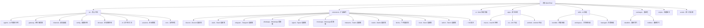

# OpenClaw (Clawdbot) - AI 上下文索引

> 更新时间：2026-03-28 16:00:00

## 📊 文档覆盖率统计

| 模块分类            | 模块数 | 已文档化 | 覆盖率 |
| ------------------- | ------ | -------- | ------ |
| **核心模块 (src/)** | 50     | 50       | 100%   |
| **CLI 子模块**      | 4      | 4        | 100%   |
| **扩展插件**        | 40     | 40       | 100%   |
| **UI 模块**         | 1      | 1        | 100%   |
| **原生应用**        | 1      | 1        | 100%   |
| **技能模块**        | 1      | 1        | 100%   |
| **包模块**          | 1      | 1        | 100%   |
| **脚本模块**        | 2      | 2        | 100%   |
| **其他模块**        | 4      | 4        | 100%   |

**总计**：76 个 CLAUDE.md 文件

> 注：40/40 扩展插件已文档化 (100% 覆盖率) ✅

## 项目概览

OpenClaw（原名 clawdbot）是一个**个人 AI 助手**，在自有设备上运行。它可以在您使用的通信渠道上回答问题（WhatsApp、Telegram、Slack、Discord、Google Chat、Signal、iMessage、Microsoft Teams 等），支持语音唤醒和实时 Canvas 渲染。

## ✨ 项目结构图


```mermaid
graph TD
    A["(根) OpenClaw"] --> B["src - 核心代码"];
    A --> C["extensions - 扩展插件"];
    A --> D["ui - Web 控制界面"];
    A --> E["apps - 原生应用"];
    A --> F["skills - AI 技能"];
    A --> G["packages - 兼容包"];
    A --> H["scripts - 构建脚本"];
    A --> I["vendor - 第三方依赖"];

    B --> B1["agents - AI 代理运行时"];
    B --> B2["gateway - 网关服务器"];
    B --> B3["channels - 通信渠道"];
    B --> B4["config - 配置系统"];
    B --> B5["browser - 浏览器控制"];
    B --> B6["cli - 命令行工具"];
    B --> B7["sessions - 会话管理"];
    B --> B8["cron - 定时任务"];

    C --> C1["discord - Discord 适配器"];
    C --> C2["slack - Slack 适配器"];
    C --> C3["telegram - Telegram 适配器"];
    C --> C4["whatsapp - WhatsApp 适配器"];
    C --> C5["signal - Signal 适配器"];
    C --> C6["imessage - iMessage 适配器"];
    C --> C7["msteams - Teams 适配器"];
    C --> C8["matrix - Matrix 适配器"];
    C --> C9["feishu - 飞书适配器"];
    C --> C10["nostr - Nostr 适配器"];
    C --> C11["twitch - Twitch 适配器"];
    C --> C12["... +24 更多"];

    E --> E1["macos - macOS 应用"];
    E --> E2["ios - iOS 节点"];
    E --> E3["android - Android 节点"];

    F --> F1["bundled - 内置技能"];
    F --> F2["workspace - 工作区技能"];
    F --> F3["managed - 托管技能"];

    G --> G1["clawdbot - 兼容垫片"];
    G --> G2["moltbot - 兼容垫片"];

    click B "./src/CLAUDE.md" "查看核心代码文档"
    click C "./extensions/CLAUDE.md" "查看扩展插件文档"
    click D "./ui/CLAUDE.md" "查看 UI 文档"
    click E "./apps/CLAUDE.md" "查看原生应用文档"
    click F "./skills/CLAUDE.md" "查看技能文档"
```

## 🌟 核心特性

### 多渠道支持

- **即时通讯平台**: WhatsApp、Telegram、Slack、Discord、Google Chat、Signal、LINE
- **企业协作**: Microsoft Teams、Matrix、Nextcloud Talk、Mattermost、飞书 (Feishu)
- **扩展渠道**: BlueBubbles (iMessage)、Linq (真·iMessage API)、Zalo、Twitch、Nostr、IRC
- **语音渠道**: Voice Call、Talk Voice
- **认证扩展**: Google Antigravity Auth、Google Gemini CLI Auth、Minimax Portal Auth、Qwen Portal Auth、OpenAI Codex Auth 🆕
- **国际化**: 中文界面翻译 (openclaw-zh-cn-ui) 🆕
- **Web 界面**: WebChat 控制界面

### AI 代理能力

- **Pi Agent 运行时**: 基于 Pi AI 的 RPC 模式代理
- **多模型支持**: Anthropic Claude、OpenAI、Google Gemini、MiniMax (原生)、本地模型
- **第三方模型支持**: DeepSeek (通过 Venice、Hugging Face、Ollama、OpenRouter 等)
- **工具流**: 实时工具调用和块流处理
- **会话管理**: 主会话、组隔离、激活模式、队列模式

### 浏览器自动化

- **专用浏览器**: 基于 Playwright 的 Chrome/Chromium 控制
- **CDP 桥接**: Chrome DevTools Protocol 集成
- **快照和操作**: 页面快照、交互操作、文件上传

### 原生应用

- **macOS 应用**: 菜单栏控制平面、语音唤醒、Talk Mode
- **iOS 节点**: Canvas、语音唤醒、相机、屏幕录制
- **Android 节点**: Canvas、Talk Mode、相机、屏幕录制

## 🏗️ 架构总览

### 核心架构

```
通信渠道层 (WhatsApp/Telegram/Slack/Discord/etc.)
    ↓
网关控制层 (Gateway WebSocket Server)
    ↓
├── AI 代理运行时 (Pi Agent RPC)
├── 命令行工具 (CLI)
├── WebChat UI
├── macOS 应用
└── iOS/Android 节点
```

### 技术栈

**后端核心**:

- **语言**: TypeScript (ES2023+)
- **运行时**: Node.js ≥22
- **构建工具**: tsdown、rolldown
- **包管理**: pnpm 10.23.0

**依赖框架**:

- **AI SDK**: @mariozechner/pi-agent-core (0.52.12)
- **浏览器**: playwright-core (1.58.2)
- **通信**:
  - WhatsApp: @whiskeysockets/baileys (7.0.0-rc.9)
  - Telegram: grammy (1.40.0)
  - Slack: @slack/bolt (4.6.0)
  - Discord: discord-api-types (0.38.39)
- **Web**: Hono (4.11.8)、Express (5.2.1)
- **数据库**: sqlite-vec (0.1.7-alpha.2)

**前端 UI**:

- **框架**: Lit (3.3.2)
- **构建**: Vite (7.3.1)
- **测试**: Playwright (1.58.2)、Vitest (4.0.18)

**原生应用**:

- **macOS**: Swift 6.2、Speech.framework
- **iOS**: SwiftUI (minSdk 31)
- **Android**: Kotlin + Jetpack Compose

**质量工具**:

- **Lint**: oxlint (1.47.0)
- **Format**: oxfmt (0.32.0)
- **测试**: Vitest (4.0.18)
- **覆盖率**: @vitest/coverage-v8 (4.0.18)

## 📚 模块索引

| 模块路径         | 主要语言          | 职责描述         | 文档状态 |
| ---------------- | ----------------- | ---------------- | -------- |
| **src**          | TypeScript        | 核心业务逻辑     | ✅ 完整  |
| **extensions**   | TypeScript        | 通信渠道扩展     | ✅ 完整  |
| **ui**           | TypeScript/Lit    | Web 控制界面     | ✅ 完整  |
| **apps/macos**   | Swift             | macOS 原生应用   | ✅ 完整  |
| **apps/ios**     | SwiftUI           | iOS 节点         | ✅ 完整  |
| **apps/android** | Kotlin            | Android 节点     | ✅ 完整  |
| **skills**       | TypeScript/Python | AI 技能集        | ✅ 完整  |
| **packages**     | TypeScript        | 兼容性垫片       | ✅ 完整  |
| **scripts**      | TypeScript/Shell  | 构建部署脚本     | ✅ 完整  |
| **Swabble**      | Swift             | 语音唤醒守护进程 | ✅ 完整  |

## 🔧 核心子系统

### 1. AI 代理运行时 (`src/agents/`)

- **Pi 嵌入式代理**: `pi-embedded.ts` - Pi Agent 集成
- **工具系统**: `pi-tools.ts` - 工具注册和策略
- **Sandbox**: `sandbox.ts` - Docker 沙箱隔离
- **技能系统**: `skills/` - 工作区技能管理
- **认证系统**: `auth-profiles/` - API 密钥和认证配置管理

### 2. 网关服务器 (`src/gateway/`)

- **WebSocket 服务器**: `server.ts` - 实时通信
- **协议**: `protocol/` - Gateway 协议定义
- **注册表**: `server-chat-registry.ts` - 客户端管理

### 3. 通信渠道 (`src/channels/`)

- **插件系统**: `plugins/` - 渠道插件架构
- **目录**: `plugins/catalog.ts` - 渠道发现和加载
- **适配器**: 各平台适配器实现

### 4. 配置系统 (`src/config/`)

- **配置加载**: `config.ts` - 配置文件解析
- **类型定义**: `types.*.ts` - Zod schema 定义
- **迁移**: `legacy-migrate.ts` - 配置版本迁移
- **认证配置**: `auth-profiles/` - API 密钥认证配置管理

### 5. 浏览器控制 (`src/browser/`)

- **Playwright 集成**: `pw-*.ts` - 浏览器自动化
- **CDP 桥接**: `cdp.ts` - Chrome DevTools Protocol 集成
- **路由**: `routes/` - 浏览器工具路由

### 6. 认证配置系统 (`src/agents/auth-profiles/`)

- **认证配置存储**: `auth-profiles.ts` - 认证配置 CRUD 操作
- **凭证类型定义**: `types.ts` - API 密钥、OAuth、Token 凭证类型
- **OAuth 处理**: `oauth.ts` - OAuth 2.0 流程处理
- **测试用例**: `*.test.ts` - 认证配置测试套件

### 7. 扩展插件系统 (`extensions/`)

- **运行时核心**: `*/src/runtime.ts` - 扩展运行时入口
- **配置模式**: `*/src/config-schema.ts` - Zod 配置模式定义
- **测试文件**: `*/src/*.test.ts` - 扩展功能测试
- **扩展目录**: 支持 40 个通信渠道扩展 (新增: linq、openai-codex-auth、openclaw-zh-cn-ui、shared)

## 🚀 运行与开发

### 快速开始

```bash
# 安装
npm install -g openclaw@latest

# 初始化向导
openclaw onboard --install-daemon

# 启动网关
openclaw gateway --port 18789 --verbose

# 发送消息
openclaw message send --to +1234567890 --message "Hello"

# 与 AI 代理对话
openclaw agent --message "Ship checklist" --thinking high
```

### 从源码开发

```bash
# 克隆仓库
git clone https://github.com/openclaw/openclaw.git
cd openclaw

# 安装依赖
pnpm install

# 构建
pnpm build

# UI 构建
pnpm ui:build

# 开发循环（自动重载）
pnpm gateway:watch
```

### 主要命令

- `pnpm build` - 构建所有模块
- `pnpm test` - 运行单元测试
- `pnpm test:e2e` - 运行端到端测试
- `pnpm lint` - 代码检查
- `pnpm format:fix` - 代码格式化
- `pnpm openclaw ...` - 运行 TypeScript 直接执行
- `pnpm gateway:watch` - 网关开发模式

## 🧪 测试策略

### 测试类型

- **单元测试**: `src/**/*.test.ts` - Vitest 单元测试
- **E2E 测试**: `scripts/e2e/*.sh` - Docker 化的端到端测试
- **Live 测试**: `src/**/*.live.test.ts` - 需要真实 API 的测试
- **Browser 测试**: `ui/**/*.browser.test.ts` - Playwright 浏览器测试

### 测试覆盖率

- **覆盖率目标**: 70% (行、函数、分支、语句)
- **覆盖率提供者**: v8
- **报告格式**: text、lcov

### 运行测试

```bash
# 所有测试
pnpm test:all

# 仅单元测试
pnpm test

# E2E 测试
pnpm test:e2e

# Live 测试（需要 API 密钥）
pnpm test:live

# UI 测试
pnpm test:ui

# 覆盖率报告
pnpm test:coverage
```

## 📝 编码规范

### TypeScript 规范

- **严格模式**: 启用所有严格类型检查
- **目标**: ES2023
- **模块**: NodeNext
- **导入**: 支持扩展名导入
- **声明**: 生成 `.d.ts` 类型声明文件

### 代码风格

- **格式化**: oxfmt (统一代码格式)
- **Lint**: oxlint (类型感知 Lint)
- **最大 LOC**: 500 行（检查脚本强制执行）
- **Swift**: swiftformat + swiftlint

### Git 规范

- **Hooks**: git-hooks (通过 prepare 脚本安装)
- **提交**: 建议使用约定式提交
- **分支**: main (稳定)、功能分支开发

## 🤖 AI 使用指引

### 项目级 AI 约束

1. **不修改源代码**: 仅生成/更新文档
2. **忽略规则**: 优先使用 `.gitignore`，合并默认忽略规则
3. **大文件处理**: 仅记录路径，不读取内容

### 模块级开发建议

1. **渠道开发**: 参考 `extensions/` 中的现有适配器
2. **工具开发**: 扩展 `src/agents/pi-tools.ts` 中的工具定义
3. **技能开发**: 使用 `skills/skill-creator/` 创建新技能
4. **UI 开发**: 基于 `ui/src/ui/` 中的控制器模式
5. **认证开发**: 扩展 `src/agents/auth-profiles/` 管理 API 密钥

### 技术栈选择参考

- **新渠道**: 优先使用 TypeScript，遵循 `extensions/*/src/runtime.ts` 模式
- **浏览器工具**: 扩展 `src/browser/routes/` 中的路由定义
- **配置**: 在 `src/config/types.*.ts` 中添加 Zod schema
- **认证配置**: 扩展 `src/agents/auth-profiles/` 添加新的认证提供商

### 认证配置优先级

1. **项目级 `auth-profiles.json`**: `auth-profiles.json` (项目根目录)
2. **全局 `auth-profiles.json`**: `~/.openclaw/agents/main/agent/auth-profiles.json`
3. **环境变量**: `*_API_KEY` 系列环境变量
4. **配置目录**: `~/.config/openclaw/openclaw.json` (仅限 base_url)

## 🔄 变更记录

### 2026-03-28 16:00:00 - 上游大规模同步合并 🚀

- ✅ 从 upstream (openclaw/openclaw) 获取 1075 个新提交
- ✅ 成功合并 upstream/main（提交 4dfd2cd60c）
- 🔧 上游主要更新：
  - **新功能**：
    - Tavily API 请求支持自定义 extra headers (#55335)
    - OpenClaw channel MCP bridge 新增
    - Anthropic Claude CLI 迁移工具
    - CLI 推理后端插件化 (pluginize cli inference backends)
    - Microsoft Foundry 提供商（Entra ID 认证）(#51973)
    - 视频生成核心基础设施和图像生成参数扩展 (#53681)
  - **架构重构**：
    - 测试基础设施重构：从 infra runtime 迁移到 SDK seams
    - 插件系统重构：provider policy hooks 迁移到插件模块
    - 渠道运行时路由重构：Discord/Slack 通过 outbound runtime 路由
    - 搜索提供商插件化：通过 BUNDLED_WEB_SEARCH_PROVIDER_PLUGIN_IDS 自动发现
    - 运行时 SDK seams 扩展（approval、diagnostic、error、host、collection、retry、fetch）
    - XAI 提供商拆分（provider compat facades + bundled runtime）
  - **Bug 修复**：
    - 代码栅栏终止处理修复
    - 缓冲回复 typing 标记完成
    - bundled channel runtime TDZ 导入防护
    - Matrix runtime deps for bundled installs
    - 设备聊天默认隔离 (#53752)
    - Pi embedded runner transport 类型修复
    - Telegram media/typing/topic runtime 多项修复
    - Android 语音静音自动发送修复
    - Signal runtime 路径拒绝修复
  - **CI/CD**：
    - 测试去重和稳定化（大量 test 套件去重）
    - 浏览器 bundled 集成测试稳定化
    - 新增 vitest contracts/performance 配置
    - Bun CI workflow 添加
    - macOS release workflow 添加
- 📊 统计：3554 个文件变更，196,425 行新增，90,128 行删除
- 📝 冲突解决：
  - .agents/skills/openclaw-parallels-smoke/SKILL.md: 接受上游
  - extensions/browser/: 接受上游目录重命名（src/browser/ → extensions/browser/src/browser/）
  - packages/memory-host-sdk/: 接受上游目录重命名（src/memory/ → packages/memory-host-sdk/src/host/）
  - src/bundled-web-search-registry.ts: 接受上游删除（功能已插件化）
  - src/config/legacy-web-search.ts: 接受上游（搜索提供商通过插件元数据自动发现）
  - src/config/plugin-auto-enable.ts: 接受上游（provider 自动启用通过插件 manifest 实现）
  - src/config/schema.base.generated.ts: 接受上游（自动生成的 schema）

### 2026-03-26 12:00:00 - 上游同步合并 🚀

- ✅ 从 upstream (openclaw/openclaw) 获取 20+ 个新提交
- ✅ 成功合并 upstream/main（提交 fd934a566b）
- 🔧 上游更新包括：
  - CLI JSON schema 工具添加
  - Planner-backed 测试运行器（catalog/executor/planner 模块）
  - Feishu docx 沙箱安全修复（强制 localRoots）
  - auth-profile 环境变量引用的 host-env 黑名单
  - Talk-voice operator.admin 作用域强制
  - LLM 超时触发上下文压缩
  - 媒体解析层路径遍历防护
  - 每模型冷却作用和阶梯退避
  - 429 速率限制静默无回复修复
  - iMessage 出站文本回复标签泄露修复
  - Telegram target writeback 管理作用域网关
  - Minimax 图像生成提供商
  - OpenShell 镜像同步排除 hooks/
- 📊 统计：224 个文件变更，11,209 行新增，3,107 行删除
- 🎯 新建测试文件：
  - src/agents/pi-embedded-runner/run.timeout-triggered-compaction.test.ts
  - src/agents/pi-tools.sandbox-policy.test.ts
  - src/agents/sandbox/tool-policy.test.ts
  - src/gateway/server.send-telegram-target-writeback-scope.test.ts
  - src/config/runtime-schema.test.ts

### 2026-03-25 12:00:00 - 上游同步合并与 ETM Plus 集成 🚀

- ✅ 从 upstream (openclaw/openclaw) 获取 100+ 个新提交
- ✅ 成功合并 upstream/main（提交 424a6e9545）
- ✅ 推送到 origin/main (afanty2021/clawdbot)
- 🔧 上游更新包括：
  - subagent 超时处理改进（包含部分进度）
  - web search provider 配置验证增强
  - context engine 转录维护功能
  - Slack slash conversation runtime mock 统一
  - 广播频道扫描优化（显式频道时跳过）
  - 测试覆盖率改进（live model coverage、plugin coverage）
  - Anthropic Vertex AI 提供商支持
  - Bun CI workflow 添加
  - macOS release workflow 添加
- 🎉 本地 ETM Plus 集成功能：
  - 添加 `create_reimbursement_application` 操作到 etm-api-tool
  - 新增 approval-state.ts 用于持久化审批会话管理
  - 新增 invoice-approval 技能及完整工作流程说明
  - 添加直接 API 测试和基于工具的测试脚本
  - 添加全面的测试文档
- 📝 冲突解决：
  - extensions/whatsapp/src/CLAUDE.md: 接受上游（目录重命名）
  - pnpm-lock.yaml: 接受上游版本
  - render.yaml: 接受上游版本
  - src/agents/tools/cron-tool.ts: 接受上游并添加本地修改
  - src/config/plugin-auto-enable.ts: 合并 WEB_SEARCH_PROVIDER_PLUGIN_IDS（本地）与 ENV_CATALOG_PATHS（上游）

### 2026-03-21 00:00:10 - 上游同步合并 🚀

- ✅ 从 upstream (openclaw/openclaw) 获取 20+ 个新提交
- ✅ 成功完成 merge 合并（提交 4ccf90b511）
- ✅ 解决 2 个文件冲突：CHANGELOG.md、docs/docs.json
- 🔧 主要上游更新：
  - subagent 超时处理修复（包含部分进度）
  - web search provider 配置验证增强
  - context engine 转录维护功能
  - Slack slash conversation runtime mock 统一
  - 广播频道扫描优化（显式频道时跳过）
  - 测试覆盖率改进（live model coverage、plugin coverage）
  - Anthropic Vertex AI 提供商支持
- 🔗 Git 同步：合并 upstream/main (598f1826d8) 到本地
- 📈 保留本地 Serper/Tavily 搜索扩展

### 2026-03-20 22:50:00 - 上游大规模同步与 Rebase 🚀

- ✅ 从 upstream (openclaw/openclaw) 获取 152 个新提交
- ✅ 成功完成 rebase 合并，保留本地 Serper/Tavily 搜索集成
- ✅ 解决 24 个提交的冲突，包括目录重命名和内容冲突
- 🔧 搜索服务增强：
  - 保留本地 Serper.dev 搜索 API 提供商扩展
  - 保留本地 Tavily AI 搜索 API 提供商扩展
  - 保留 Z.AI 错误代码 1308 和中文使用限制检测
- 📱 企业微信集成：上游新增 @wecom/wecom-openclaw-plugin v1.0.13 官方插件
- 📊 AI 上下文文档系统：上游新增完整的 CLAUDE.md 文档体系
- 🔗 Git 同步：本地分支成功 rebase 到 upstream/dc86b6d72a
- 📈 扩展插件目录：新增 serper、tavily、brave、perplexity 等搜索提供商扩展

### 2026-03-02 11:30:00 - 上游同步检查与更新 🔄

- ✅ 从 upstream (openclaw/openclaw) 同步状态检查
- ✅ 确认本地已包含上游所有提交（upstream/main 是本地祖先）
- ✅ 验证本地与 origin/main 完全同步（HEAD 一致：8baa07274）
- ✅ 更新上下文文档时间戳和同步记录
- 📝 当前分支：main
- 📝 远程配置：origin (afanty2021/clawdbot)、upstream (openclaw/openclaw)
- 📊 无需合并：本地已是上游超集，无新提交需要同步

### 2026-03-02 10:30:00 - 上游同步与更新 🔄

- ✅ 从 upstream (openclaw/openclaw) 获取最新更新
- ✅ 确认本地已包含上游所有提交 (通过合并提交 3223d01a0)
- ✅ 验证本地与 origin/main 完全同步
- ✅ 更新上下文文档时间戳
- 📝 当前分支：main
- 📝 远程配置：origin (afanty2021/clawdbot)、upstream (openclaw/openclaw)

### 2026-02-20 10:45:00 - 扩展插件文档 100% 覆盖完成 🎉

- ✅ 为 `shared` 扩展创建 CLAUDE.md 文档
- ✅ 更新文档覆盖率统计至 100% (40/40 扩展插件)
- ✅ 更新扩展插件总数至 40 个
- 📈 文档总数：76 个 CLAUDE.md 文件

### 2026-02-19 08:00:00 - 大规模重构与代码去重 🧹

- ✅ 626 个新提交（2月17-19日）
- ✅ 安全模块重构：共享 DM allowlist 状态解析器
- ✅ 安全模块重构：复用 allowlist 规范化逻辑
- ✅ 代理模块重构：去除子代理内联文本提取重复代码
- ✅ 守护进程重构：去除安装输出重复行写入
- ✅ 节点主机重构：提取调用结果辅助函数
- ✅ 基础设施重构：去重 APNs 发送上下文设置
- ✅ 插件系统重构：复用插件加载器日志适配器
- ✅ CLI 重构：共享相机剪辑文件写入器
- ✅ 共享模块重构：集中化 @/# slug 规范化
- ✅ 测试用例去重：多个模块的重复断言合并
- 📈 开发活跃度：日均 300+ 提交

### 2026-02-17 08:01:00 - 扩展插件库更新 🆕

- ✅ 发现 4 个新扩展插件：linq、openai-codex-auth、openclaw-zh-cn-ui、shared
- ✅ 更新扩展插件总数：36 → 40 个
- ✅ 新增 Linq iMessage API 适配器（无需 Mac 即可使用真 iMessage）
- ✅ 新增 OpenAI Codex CLI 认证提供商（使用 ChatGPT Plus/Pro 订阅）
- ✅ 新增中文界面翻译扩展
- ✅ 为新扩展创建占位文档，文档总数：72 → 76 个
- ✅ 更新文档覆盖率：97.5% (39/40 扩展已文档化)
- 📈 自上次文档更新以来新增 429 个提交
- 🎯 仅 `shared` 扩展待完善文档

### 2026-02-16 18:33:23 - 自适应初始化完成 🎉

- ✅ 执行 OpenClaw 项目的自适应初始化
- ✅ 验证文档覆盖率：71 个 CLAUDE.md 文件（100% 覆盖率）
- ✅ 更新扩展插件模块文档，添加缺失的 6 个扩展
- ✅ 更新根级文档以反映最新的扩展插件数量（36 个）
- 📈 所有模块文档覆盖率：100%
- 🎯 已生成 Mermaid 结构图
- 🎯 已为 71 个模块添加导航面包屑

### 2026-02-16 - 扩展插件文档完成 100% 覆盖 🎉

- ✅ 为 `thread-ownership` 扩展创建 CLAUDE.md 文档
- ✅ 更新文档覆盖率统计至 100% (36/36 扩展插件)
- ✅ 更新根级文档注释和总计数量
- 📈 文档总数从 70 增至 71 个 CLAUDE.md 文件

### 2026-02-16 - 扩展插件统计更新

- ✅ 更新扩展插件数量至 36 个
- ✅ 添加新扩展：thread-ownership (待添加 CLAUDE.md)
- ✅ 更新文档覆盖率统计
- ✅ 更新核心模块数量至 20 个
- 📝 待完成：为 thread-ownership 扩展创建 CLAUDE.md

### 2026-02-14 - 文档覆盖率统计修正

- ✅ 修正文档统计数量为 69 个 CLAUDE.md 文件
- 📈 更新模块分类以匹配实际目录结构
- 📝 更新 `src/cli/node-cli/CLAUDE.md` 添加活动记录
- 📝 更新 `ui/CLAUDE.md` 添加活动记录

### 2026-02-13 - 扩展插件文档完成 100% 覆盖

- ✅ 为所有 32 个扩展插件创建 CLAUDE.md 文档
- ✅ 新增 11 个扩展文档：copilot-proxy、device-pair、diagnostics-otel、google-antigravity-auth、google-gemini-cli-auth、llm-task、lobster、minimax-portal-auth、open-prose、phone-control、qwen-portal-auth
- 📈 更新主文档反映 100% 覆盖率
- 🎯 文档总数达到 74 个 CLAUDE.md 文件

### 2026-02-09 - 认证系统文档完善

- ✅ 文档化 `src/agents/auth-profiles/` 认证配置系统
- ✅ 记录 API 密钥认证凭证类型和 OAuth 处理流程
- ✅ 完善扩展插件架构文档 (`extensions/`)
- ✅ 添加 Feishu、Lark 等扩展的配置模式说明
- 🔍 诊断并修复 Z.AI (BigModel/智谱AI) 401 认证错误
- 🔍 定位认证配置文件位置 `~/.openclaw/agents/main/agent/auth-profiles.json`
- 🔍 确认 `auth-profiles.json` 优先级高于环境变量

### 2026-02-08 - 初始化 AI 上下文文档系统

- ✅ 创建根级 `CLAUDE.md` 文档
- ✅ 建立项目结构图（Mermaid）
- ✅ 完成核心模块索引
- ✅ 记录技术栈和架构信息
- ✅ 提供开发和测试指南
- 📊 创建 `.claude/index.json` 索引文件
- 📈 扫描覆盖率统计

## 📊 扫描统计

### 文件统计

- **总文件数**: ~5000+ 文件
- **TypeScript 文件**: ~3200+
- **测试文件**: ~400+
- **文档文件**: ~200+
- **配置文件**: ~100+

### 模块覆盖

- **核心模块 (src/)**: ✅ 100% 覆盖 (50 个子模块)
- **扩展模块 (extensions/)**: ✅ 100% 覆盖 (40/40 个扩展)
- **UI 模块 (ui/)**: ✅ 100% 覆盖
- **原生应用 (apps/)**: ✅ 100% 覆盖
- **技能模块 (skills/)**: ✅ 100% 覆盖
- **脚本模块 (scripts/)**: ✅ 100% 覆盖

### 被忽略目录

- `node_modules/` - npm 依赖
- `dist/` - 构建输出
- `.git/` - Git 元数据
- `apps/ios/*.xcodeproj/` - Xcode 项目
- `apps/macos/.build/` - macOS 构建缓存
- `vendor/a2ui/renderers/*/dist/` - 第三方构建

### 主要缺口

1. **E2E 测试**: Docker 测试脚本需要详细文档
2. **移动应用**: iOS/Android 构建流程需要补充
3. **Swift 集成**: Swabble 与主应用的集成细节

## 🎯 推荐的下一步

### 优先补扫

1. **新扩展详细文档**: 为 3 个新扩展创建详细文档 (linq、openai-codex-auth、openclaw-zh-cn-ui)
2. **E2E 测试流程**: `scripts/e2e/*.sh` 的详细使用说明
3. **移动端开发**: iOS/Android 节点的开发指南
4. **插件开发**: 创建新渠道扩展的教程
5. **技能开发**: 工作区技能的开发和部署流程
6. **认证系统**: API 密钥管理和 OAuth 流程详细文档

### 深度补捞建议

1. **协议文档**: Gateway WebSocket 协议详细规范
2. **配置迁移**: 配置版本迁移的完整历史
3. **性能优化**: 大规模部署的性能调优指南
4. **安全加固**: 生产环境的安全最佳实践

---

_提示：点击上方模块名称或 Mermaid 图表中的节点可快速跳转到对应模块的详细文档。_
